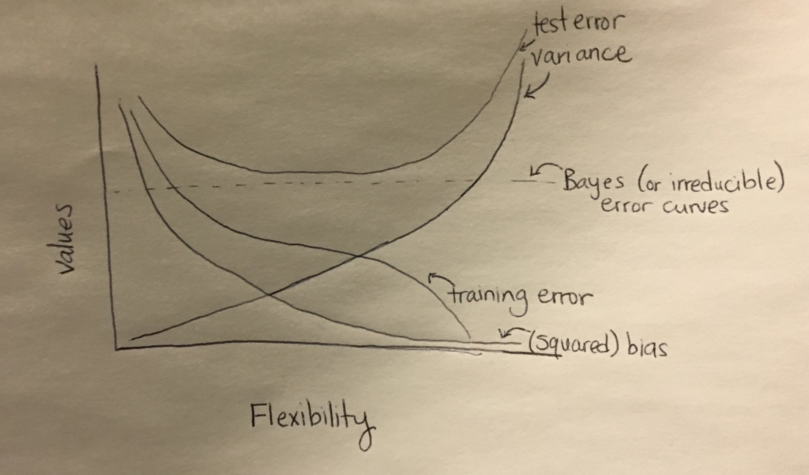

# Topic 1 Exercises
# Jina Park

## Discussion Questions

### ISL 2.4.1
(a) (The sample size n is incredibly large, and the number of predictors p is small.) In this case, we would generally expect the performance of a flexible statistical learning method to be better than an inflexible method. This is because the large sample size allows the flexible method to better fit the data than the inflexible method.

(b) (The number of predictors p is extremely large, and the number of observations n is small.) In this case, we would generally expect the performance of a flexible statistical learning method to be worse than the inflexible method because the flexible method would lead to overfitting due to the small sample size.

(c) (The relationship between the predictors and response is highly non-linear.) In this case, we would generally expect the performance of the flexible statistical learning method to be better than the inflexible method because the flexibility allows it to better fit the data.

(d) (The variance of the error terms is extremely high.) In this case, we would generally expect the performance of the flexible statistical learning method to be worse than the inflexible method because the large variance of the error terms causes the flexible models to capture too much of the noise in the data.

### ISL 2.4.3
(a)




(b) Bias decreases with higher flexibility. For this reason, the squared bias curve decreases at at a decreasing rate until it reaches some minimum value. Variance tends to increase with higher flexibility. For this reason, the variance curve is increasing at an increasing rate. The training error curve decreases as the flexibility increases due to the fact that the curve better fits the data. The test error curve is U-shaped. This is because as the flexibility increases, the test error drops to a certain minimum value. However, after that minimum point, the training error starts to rise as the more flexible models start to overfit the data. The Bayes (or irreducible) error curves is constant and is thus represented by a horizoatal line.

### ISL 2.4.6
Describe the differences between a parametric and non-parametric statistical learning approach. What are the advantages of a parametric approach to regression or classification (as opposed to a non-parametric approach)? What are its disadvantages?

Non-parametric methods do not make explicit assumptions about the functional form of f. They seek an estimate of f that gets as close to the data points as possible withough being too rough or wiggly. On the other hand, parametric methods reduce the problem of estimating f down to one by estimating a set of parameters. An advantage of a parametric approach to regression or classification is that the parametric approach is more flexible and can thus fit more kinds of data. The parametric approach can be used with a simple model whereas a non-parametric approach requires lots of parameters and observations. Some disadvantages of the parametric approach are that it might overfit the data and requires more assumptions, which could lead to errors.


## Computing Assignment
### ISL 2.4.8
(a)
```{r}
college <- read.csv("/home/local/MAC/jpark2/Math-253-Assignments/College.csv", header = TRUE)
```

(b) SKIP
```{r}
#rownames(college) <- college[,1]
#fix(college)
```

```{r}
#college <- college[ ,-1]
#fix(college)
```

(c) 
(i)
```{r}
summary(college)
```

(ii)
```{r}
pairs(college[, 1:10]) #scatterplot matrix of first ten columns of matrix
```

(iii)
```{r}
boxplot(college$Outstate ~ college$Private, col=c("red", "blue"), main ="Outstate vs Private", xlab = "Private", ylab = "Outstate")
```

(iv) There are 78 elite colleges and 699 non-elite colleges.

```{r}
Elite <- rep("no", nrow(college))
Elite[college$Top10perc > 50] = "Yes"
Elite <- as.factor(Elite)
college <- data.frame(college, Elite)
summary(college)
boxplot(college$Outstate ~ college$Elite, col=c("red", "blue"), main ="Outstate vs Elite", xlab = "Elite", ylab = "Outstate")
```

(v)
```{r}
par(mfcol = c(2,3))
hist(college$Accept, breaks = 10, freq = TRUE, col = "red", main = "Histogram", xlab = "Accept")
hist(college$Top10perc, breaks = 10, freq = TRUE, col = "red", main = "Histogram", xlab = "Top10perc")
hist(college$Top25perc, breaks = 10, freq = TRUE, col = "red", main = "Histogram", xlab = "Top25perc")
hist(college$Enroll, breaks = 10, freq = TRUE, col = "red", main = "Histogram", xlab = "Enroll")
hist(college$Apps, breaks = 10, freq = TRUE, col = "red", main = "Histogram", xlab = "Apps")
hist(college$Expend, breaks = 10, freq = TRUE, col = "red", main = "Histogram", xlab = "Expend")

```

(vi) 
```{r}
summary(college$Top10perc)
summary(college$Top25perc)
summary(college$Apps)
summary(college$Accept)
```

The histograms for Accept, Apps, and Top10perc appear to be heavily skewed to the right whereas the histograms for the Top25pec and Expend appear slightly more normal.

### ISL 2.4.9
```{r}
Auto <- read.csv("/home/local/MAC/jpark2/Math-253-Assignments/Auto.csv")
Auto <- na.omit(Auto)
str(Auto)
```

(a) Quantitative Predictors: mpg, cylinders, displacement, weight, acceleration, year, origin

Qualitatitive Predictors: horsepower, name

(b)
```{r}
range(Auto$mpg)
range(Auto$cylinders)
range(Auto$displacement)
range(Auto$weight)
range(Auto$acceleration)
range(Auto$year)
range(Auto$origin)
```
Range of mpg: (9, 46.6)

Range of cylinders: (3, 8)

Range of displacement: (68, 455)

Range of weight: (1613, 5140)

Range of acceleration: (8, 24.8)

Range of year: (70, 82)

Range of origin: (1, 3)

(c)

```{r}
sapply(Auto[, -c(4,9)], mean)
sapply(Auto[, -c(4,9)], sd)
```
 
 Mean of mpg: 23.445918; sd of mpg: 7.8050075
 
 Mean of cylinder: 5.471939; sd of cylinder: 1.7057832
 
 Mean of displacement: 194.411990; sd of displacement: 104.6440039
 
 Mean of weight: 2977.584184; sd of weight: 849.4025600
 
 Mean of acceleration: 15.541327; sd of accelearation: 2.7588641
 
 Mean of year: 75.979592; sd of year: 3.6837365
 
 Mean of origin: 1.576531; sd of origin: 0.8055182
 
(d) 
```{r}
auto2 <- Auto[-c(10:85), -c(4,9)]
sapply(auto2, range)
sapply(auto2, mean)
sapply(auto2, sd)
```

Range of mpg: [11.0, 46.6] 

Range of cylinders: [3, 8]

Range of displacement: [68, 455]

Range of weight: [1649, 4997]

Range of acceleration: [8.5, 24.8]

Range of year: [70, 82]

Range of origin: [1, 3]

#=========================================
Mean of mpg: 24.438629

Mean of cylinders: 5.370717

Mean of displacement: 187.049844

Mean of weight: 2933.962617

Mean of acceleration: 15.723053

Mean of year: 77.152648

Mean of origin: 1.598131

#=======================================
sd of mpg: 7.9081842

sd of cylinder: 1.6534857

sd of displacement: 99.6353853

sd of weight: 810.642984

sd of acceleration: 2.6805138

sd of year: 3.1112298

sd of origin: 0.8161627

(e)
```{r}
plot(Auto$mpg, Auto$weight)
plot(Auto$mpg, Auto$displacement)
plot(Auto$mpg, Auto$cylinders)
plot(Auto$mpg, Auto$acceleration)
plot(Auto$mpg, Auto$year)
plot(Auto$mpg, Auto$horsepower)
plot(Auto$mpg, Auto$origin)
pairs(Auto)
```
There seems to be an inverse relationship between weight and mpg of cars (i.e. the greater the weight of a car, the lower the mpg). There also seems to be an inverse relationship between displacement and mpg of cars.

(f) The plots examining the relationship of Year, horserpower, origin, and cylinders with mpg all suggest that they might be useful in predicting mpg due to the lack of correlation between the variables.


## Theory Assignment
### ISL 2.4.2
(a) Regression problem because the response variable is quantitative. We would be most interested in inference because we want to know which factors affect the CEO salary (n = 500, p = 3).

(b) Classification problem because the response variable is qualitative. We would be most interested in prediction because we predict whether the new product will be a success or a failure depending on the other variables (n = 20, p = 13).

(c) Regression problem because the response variable is quantitative. We would be most interested in prediction because we are predicting the % change in the US dollar depending on the changes in the world stock markets (n = 52, p = 3).

### ISL 2.4.7
(a) Euclidean distance

Obs. 1: sqrt((0-0)^2 + (0-3)^2) + (0-0)^2) = 3

Obs. 2: sqrt((0-2)^2 + (0-0)^2 + (0-0)^2) = 2

Obs. 3: sqrt((0-0)^2 + (0-1)^2 + (0-3)^2) = sqrt(10) = 3.1623

Obs. 4: sqrt((0-0)^2 + (0-1)^2 + (0-2)^2) = sqrt(5) = 2.2361

Obs. 5 = sqrt((0-(-1))^2 + (0-0)^2 + (0-1)^2) = sqrt(2) = 1.4142

Obs. 6 = sqrt((0-1)^2 + (0-1)^2 + (0-1)^2) = sqrt(3) = 1.7321

(b) Green because sqrt(2) is the closest value to K = 1.

(c) Red because sqrt(10) is the closest value to K = 3.

(d) If the Bayes decision boundary in this problem is highly nonlinear, we would expect the best value for K to be too small because it is easier to fit the data with less K values.


